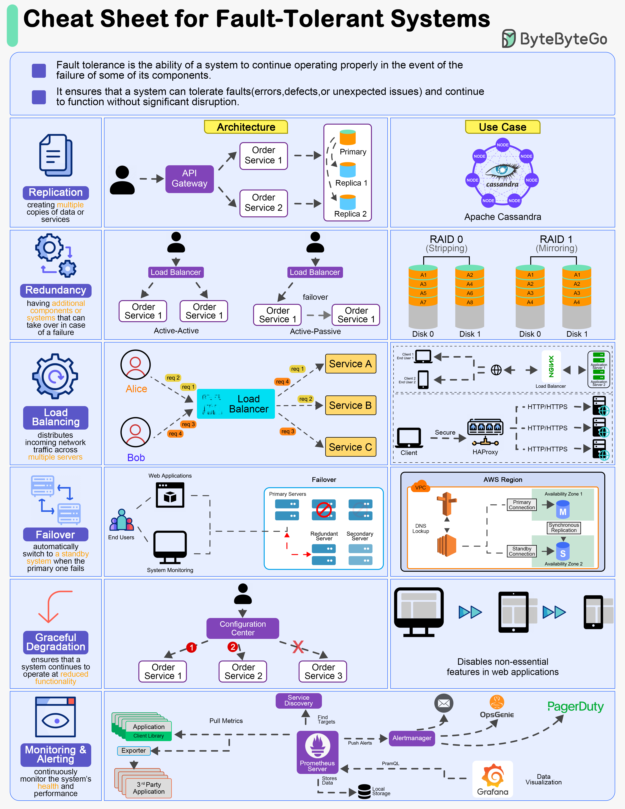

# Лекция 13: Kafka и отказоустойчивость
# Fault Tolerance: Теория отказоустойчивости

## Основные концепции

Fault Tolerance (отказоустойчивость) — это способность системы продолжать работать при отказах отдельных компонентов. В распределенных системах мы почти всегда имеем дело с partial failures — ситуациями, когда часть системы работает некорректно, а остальные компоненты функционируют нормально.

Ключевая идея: в распределенной системе любой компонент может отказать в любой момент, и мы должны быть к этому готовы.

## Partial Failures — частичные отказы

Partial failure — это фундаментальное отличие распределенных систем от локальных. На одном сервере отказ обычно полный: либо система работает, либо нет. В распределенной системе может отказать один узел, в то время как остальные продолжают работать.

Примеры partial failures:
- Один сервис из микросервисной архитектуры недоступен
- Сеть между двумя дата-центрами нарушена
- База данных отвечает с огромной задержкой
- Диск на одном узле заполнен

Такие отказы особенно коварны, потому что их сложно обнаружить и отличить от просто медленной работы.

## Репликация данных

Репликация — создание копий данных на нескольких узлах — основной способ обеспечения отказоустойчивости. Существует несколько подходов:

**Single-Leader репликация** (Master-Slave): Один узел (лидер) принимает записи, остальные (последователи) только читают. Если лидер падает, один из последователей становится новым лидером. Проблема: в момент выбора нового лидера система может быть недоступна для записи.

**Multi-Leader репликация**: Несколько узлов могут принимать записи. Полезно для географически распределенных систем, но требует механизмов разрешения конфликтов.

**Leaderless репликация**: Любой узел может обрабатывать запросы. Клиент отправляет запросы нескольким узлам и ждет ответов от большинства. Используется в Cassandra, DynamoDB.

Важный компромисс: между синхронной репликацией (гарантия консистентности, но риск недоступности) и асинхронной (высокая доступность, но возможна потеря данных).

## Партиционирование (Sharding)

Партиционирование — горизонтальное разделение данных на меньшие части, распределенные по разным узлам. Это необходимо, когда данные не помещаются на один сервер.

Основные стратегии:

**Партиционирование по диапазону ключей**: Данные сортируются по ключу, каждый узел хранит определенный диапазон. Эффективно для запросов по диапазону, но может создавать "горячие точки".

**Партиционирование по хешу ключа**: Хеш-функция равномерно распределяет данные по узлам. Равномерная нагрузка, но невозможность запросов по диапазону.

**Консистентное хеширование**: Особый алгоритм, минимизирующий перемещение данных при добавлении/удалении узлов.

Главная проблема партиционирования — выполнение операций, затрагивающих несколько партиций. Распределенные транзакции сложны и медленны.

## Стратегии обработки отказов

**Повторные попытки (Retry)**: Простейшая стратегия, но требует осторожности. "Тупой" retry может усугубить проблему. Экспоненциальная отсрочка (exponential backoff) — увеличение интервалов между попытками — помогает избежать перегрузки системы.

**Circuit Breaker**: Паттерн "предохранитель" предотвращает повторные вызовы отказавшего сервиса. Имеет три состояния:
- Closed (нормальная работа)
- Open (блокировка вызовов после серии ошибок)
- Half-Open (пробные вызовы для проверки восстановления)

**Bulkhead**: Разделение системы на изолированные отсеки, чтобы отказ одного компонента не влиял на другие. Например, разные пулы соединений для разных сервисов.

**Таймауты и deadlines**: Установка разумных временных ограничений для операций и распространение этих ограничений по всей цепочке вызовов.

## Консенсус в распределенных системах

Задача консенсуса — достижение согласия между узлами распределенной системы, даже если некоторые из них ненадежны.

**Paxos**: Классический, но сложный для понимания алгоритм. Используется в Google Chubby.

**Raft**: Более простой алгоритм, ставший популярным в последние годы. Используется в etcd, Consul.

**Byzantine Fault Tolerance**: Алгоритмы, устойчивые к злонамеренному поведению узлов. Требуют большего количества реплик.

## Теорема CAP

Теорема Брюера утверждает, что распределенная система может гарантировать только два из трех свойств:

- **Consistency** (согласованность): Все узлы видят одни и те же данные в один момент времени
- **Availability** (доступность): Каждый запрос получает ответ (успешный или ошибка)
- **Partition Tolerance** (устойчивость к разделению): Система продолжает работать при разрыве связи между узлами

На практике partition tolerance необходима, поэтому выбор стоит между CP (консистентность и устойчивость к разделению) и AP (доступность и устойчивость к разделению).

## Мониторинг и восстановление

Обнаружение отказов — нетривиальная задача. Heartbeat-механизмы (регулярные сигналы "я жив") помогают, но создают компромисс между скоростью обнаружения и количеством ложных срабатываний.

Distributed tracing позволяет отслеживать запросы через всю систему, что критически важно для диагностики проблем в микросервисной архитектуре.

Механизмы восстановления включают checkpoint'ы (сохранение состояния в определенные моменты) и write-ahead logs (запись операций перед их выполнением) для возможности восстановления после сбоев.



# Идемпотентность

## Основная концепция

Идемпотентность — это свойство операции, позволяющее вызывать её многократно без изменения результата beyond the initial application. Простыми словами: если вы выполнили операцию один раз и затем повторили её ещё несколько раз, конечное состояние системы должно быть таким же, как если бы вы выполнили операцию только один раз.

Математически: операция f является идемпотентной, если f(f(x)) = f(x) для любого x.

## Почему это важно

В распределенных системах сетевая связь ненадежна. Клиент может отправить запрос, не получить ответа (из-за таймаута, сетевых проблем) и отправить запрос повторно. Если операция не идемпотентна, это может привести к дублированию действий — списанию денег дважды, созданию двух одинаковых заказов и т.д.

## Уровни идемпотентности

### HTTP методы:
- **GET, HEAD, OPTIONS, PUT, DELETE** — идемпотентны по спецификации
- **POST, PATCH** — не идемпотентны по умолчанию

PUT идемпотентен, потому что многократная установка ресурса в одно и то же состояние дает тот же результат. DELETE идемпотентен — удаление уже удаленного ресурса не меняет состояние.

POST не идемпотентен, потому что каждый вызов создает новый ресурс.

## Реализация в REST API

### Идемпотентные ключи
Самый распространенный подход — клиент генерирует уникальный идемпотентный ключ для каждой операции и передает его в заголовке (например, `Idempotency-Key: uuid`). Сервер запоминает, что операция с таким ключом уже выполнена, и при повторном запросе возвращает тот же результат, не выполняя операцию снова.

```java
// Псевдокод реализации
public Response processPayment(String idempotencyKey, PaymentRequest request) {
    // Проверяем, не обрабатывали ли мы уже этот запрос
    PreviousResult previous = idempotencyStore.get(idempotencyKey);
    if (previous != null) {
        return previous.getResponse(); // Возвращаем сохраненный результат
    }
    
    // Выполняем операцию
    PaymentResult result = paymentService.process(request);
    
    // Сохраняем результат
    idempotencyStore.put(idempotencyKey, result);
    
    return createResponse(result);
}
```

### Версионность ресурсов
Для операций обновления можно использовать версионность. Клиент указывает, какую версию ресурса он обновляет. Если приходит запрос на обновление устаревшей версии, сервер может его отклонить.

## Паттерны проектирования

### Компенсирующие транзакции
Если операцию нельзя сделать идемпотентной, можно предусмотреть компенсирующее действие. Например, если "резервирование товара" не идемпотентно, можно сделать "отмену резервирования" идемпотентной.

### Дедупликация на стороне сервера
Сервер отслеживает уникальные идентификаторы операций и игнорирует дубликаты. Требует распределенного хранилища для отслеживания выполненных операций.

### Оптимистичная блокировка
Использование версий ресурсов предотвращает "lost update" проблему и делает операции обновления более предсказуемыми.

## Примеры из реального мира

### Платежные системы
Платежи должны быть идемпотентны. Если клиент не получил подтверждение платежа, он может отправить запрос повторно, но деньги должны списаться только один раз.

### Создание заказов
Обычно POST /orders не идемпотентен. Но можно сделать его идемпотентным, принимая идемпотентный ключ от клиента.

### Отправка уведомлений
Отправка email или push-уведомлений часто не идемпотентна — пользователь получит несколько сообщений. Решение: отслеживать, какие уведомления уже отправлены.

## Проблемы и ограничения

### Время жизни ключей
Идемпотентные ключи не могут храниться вечно. Нужна политика очистки старых ключей.

### Распределенные системы
В распределенной системе нужно гарантировать, что все узлы согласованы в том, была ли операция выполнена. Требуются распределенные блокировки или consensus алгоритмы.

### Бизнес-логика
Некоторые операции по своей природе не могут быть идемпотентными. Например, списание последнего товара со склада — при повторном вызове товара уже не будет.

## Best Practices

1. **По умолчанию проектируйте операции как идемпотентные**
2. **Используйте идемпотентные ключи для критических операций**
3. **Четко документируйте, какие endpoints идемпотентны, а какие нет**
4. **Рассмотрите компенсирующие операции для неидемпотентных действий**
5. **Реализуйте механизм дедупликации на стороне сервера**

Идемпотентность — это не просто техническая деталь, а важный аспект проектирования надежных распределенных систем, который напрямую влияет на согласованность данных и пользовательский опыт.

# Kafka и отказоустойчивость в Spring

## Теоретические основы Kafka

### Архитектура Kafka и гарантии доставки

Apache Kafka — это распределенная потоковая платформа, построенная на принципах отказоустойчивости и высокой доступности. Основные компоненты:

**Топики (Topics)** — категории или потоки сообщений
**Партиции (Partitions)** — параллельные единицы внутри топика
**Реплики (Replicas)** — копии партиций на разных брокерах
**Consumer Groups** — группы потребителей, совместно обрабатывающих сообщения

Kafka обеспечивает три фундаментальные гарантии:
1. **Гарантия порядка** — сообщения в пределах одной партиции сохраняют порядок отправки
2. **Гарантия доставки** — подтвержденные сообщения не теряются
3. **Гарантия отказоустойчивости** — репликация данных обеспечивает сохранность при сбоях

### Модель репликации и ISR

Kafka использует механизм In-Sync Replicas (ISR) для обеспечения консистентности. Лидер партиции синхронно реплицирует данные на follower'ов. Сообщение считается коммитнутым только когда оно попало во все реплики из ISR.

При отказе лидера один из in-sync реплик автоматически становится новым лидером. Это обеспечивает непрерывность работы без потери данных.

## Отказоустойчивость на стороне продюсера

### Теория подтверждений (Acknowledgments)

Продюсеры могут настраивать уровень надежности через параметр `acks`:

- **acks=0** — нет подтверждения, максимальная производительность, возможна потеря данных
- **acks=1** — подтверждение от лидера, баланс между надежностью и производительностью  
- **acks=all** — подтверждение от всех реплик ISR, максимальная надежность

### Идемпотентность и транзакции

Идемпотентный продюсер гарантирует, что сообщение будет доставлено ровно один раз, даже при повторных отправках. Это достигается через:
- Sequence numbers для каждого сообщения
- Deduplication на стороне брокера
- Transactional API для атомарности across partitions

## Отказоустойчивость на стороне консьюмера

### Модели семантики доставки

- **At-most-once** — сообщения могут быть потеряны, но не обработаны повторно
- **At-least-once** — сообщения гарантированно обрабатываются, возможны дубли
- **Exactly-once** — каждое сообщение обрабатывается ровно один раз

### Оффсеты и коммиты

Консьюмеры отслеживают позицию чтения через оффсеты. Стратегии коммита оффсетов:

- **Автоматический коммит** — риск потери сообщений при сбое
- **Ручной коммит** — полный контроль над семантикой доставки
- **Пакетный коммит** — баланс между надежностью и производительностью

### Ретри и обработка ошибок

При обработке сообщений возможны временные ошибки. Стратегии обработки:

- **Exponential backoff** — увеличение интервалов между повторами
- **Dead Letter Topics** — перемещение безнадежных сообщений в отдельный топик
- **Circuit breaker** — временное прекращение обработки при постоянных ошибках

## Spring Kafka и отказоустойчивость

### `@KafkaListener` и обработка ошибок

Spring Kafka предоставляет развитую инфраструктуру для обработки ошибок:

```java
@KafkaListener(topics = "orders", groupId = "order-processor")
public void processOrder(Order order) {
    try {
        orderService.process(order);
    } catch (TemporaryException e) {
        throw new RetryableException("Temporary failure", e);
    } catch (PermanentException e) {
        // Логика для некорректируемых ошибок
    }
}
```

### Контейнерные фабрики и политики повтора

Конфигурация контейнера слушателя определяет поведение при ошибках:

```java
@Bean
public ConcurrentKafkaListenerContainerFactory<String, Object> kafkaListenerContainerFactory() {
    ConcurrentKafkaListenerContainerFactory<String, Object> factory = 
        new ConcurrentKafkaListenerContainerFactory<>();
    
    // Настройка политики повтора
    factory.setErrorHandler(new SeekToCurrentErrorHandler());
    factory.setRetryTemplate(retryTemplate());
    
    return factory;
}
```

## Паттерны отказоустойчивой обработки

### Compensating Transactions

Для операций, затрагивающих несколько систем, используется паттерн компенсирующих транзакций. Если основной процесс не может быть завершен, выполняются компенсирующие действия.

### Outbox Pattern

Локальная запись сообщений в базу данных в рамках транзакции бизнес-логики с последующей асинхронной отправкой в Kafka через отдельный процесс.

### Consumer Group Rebalance

При добавлении или удалении консьюмеров в группе происходит перераспределение партиций. Spring Kafka предоставляет механизмы для graceful обработки rebalance.

## Мониторинг и метрики

Kafka предоставляет богатые метрики для мониторинга:
- Lag консьюмеров
- Throughput продюсеров и консьюмеров
- Размеры партиций и топиков
- Статус репликации

Spring Boot Actuator интегрируется с Kafka для предоставления health checks и метрик.

## Практический пример

```java
@KafkaListener(
    topics = "payment-events",
    groupId = "payment-processor",
    properties = {
        "max.poll.interval.ms:300000",
        "auto.offset.reset:earliest"
    }
)
@RetryableTopic(
    attempts = "3",
    backoff = @Backoff(delay = 1000, multiplier = 2.0),
    autoCreateTopics = "false",
    include = {RetryableException.class}
)
public void processPayment(PaymentEvent event) {
    paymentService.process(event);
}
```

Этот пример показывает использование аннотации `@RetryableTopic` для автоматического ретрая с экспоненциальной отсрочкой и возможностью настройки Dead Letter Topic для безнадежных сообщений.

Отказоустойчивость в Kafka достигается через комбинацию надежной архитектуры брокера, правильной конфигурации клиентов и продуманной стратегии обработки ошибок на уровне приложения.

# Глубокая теория паттернов отказоустойчивости

## Circuit Breaker Pattern

**Circuit Breaker** (Предохранитель) — это архитектурный паттерн, реализующий механизм автоматического прерывания вызовов к проблемному сервису. Работает по аналогии с электрическим предохранителем: при перегрузке цепи он "перегорает", предотвращая повреждение всей системы.

Механизм работы основан на конечном автомате с тремя состояниями. В состоянии **CLOSED** (Закрыто) все вызовы проходят к целевому сервису, при этом ведется статистика успешных и неудачных вызовов. Для подсчета статистики используется концепция **Sliding Window** — скользящее окно, которое учитывает только последние N вызовов. Это позволяет системе реагировать на текущую ситуацию, не принимая во внимание устаревшие данные.

Когда процент неудачных вызовов превышает заданный порог (**Failure Rate Threshold**), предохранитель переходит в состояние **OPEN** (Открыто). В этом состоянии все вызовы немедленно завершаются ошибкой без обращения к целевому сервису. Это предотвращает дальнейшую нагрузку на уже проблемный сервис и дает ему время на восстановление. Время пребывания в OPEN состоянии определяется параметром **Timeout Duration**.

После истечения таймаута предохранитель переходит в состояние **HALF-OPEN** (Полуоткрыто). В этом состоянии ограниченное количество вызовов (**Permitted Number of Calls**) пропускается для тестирования восстановления сервиса. Если эти пробные вызовы успешны, предохранитель возвращается в состояние CLOSED. Если же они завершаются ошибкой, система возвращается в OPEN состояние.

Продвинутые реализации Circuit Breaker включают **Adaptive Circuit Breaking** — динамическую адаптацию параметров на основе метрик производительности. Это может включать отслеживание перцентилей задержек (95-й и 99-й перцентили), мониторинг количества параллельных запросов и показателей нагрузки системы. Условия срабатывания могут быть составными и включать комбинации различных факторов: процент ошибок, абсолютное количество ошибок в единицу времени, превышение порогов задержки ответов.

## Bulkhead Pattern

**Bulkhead** (Переборка) — паттерн изоляции ресурсов, заимствованный из кораблестроения, где водонепроницаемые переборки предотвращают затопление всего судна при повреждении одного отсека. В программных системах этот паттерн реализует изоляцию на нескольких уровнях.

**Resource Isolation** предполагает разделение вычислительных ресурсов: выделенные пулы потоков для различных сервисов, раздельные connection pools к базам данных, изолированные кэши и memory pools. **Execution Isolation** фокусируется на разделении выполнения операций: отдельные исполнители для разных категорий запросов, приоритизация критических операций, установка квот на использование CPU и памяти.

Существуют две основные модели реализации Bulkhead. **Semaphore Bulkhead** основан на счетчиках семафоров и ограничивает максимальное количество параллельных вызовов (**Max Concurrent Calls**) с возможностью задания времени ожидания освобождения семафора (**Max Wait Duration**). **ThreadPool Bulkhead** использует выделенные пулы потоков с настраиваемыми параметрами: базовое количество потоков (**Core Pool Size**), максимальное количество потоков (**Max Pool Size**), размер очереди ожидающих задач (**Queue Capacity**) и время жизни неиспользуемых потоков (**Keep Alive Time**).

Управление ресурсами в Bulkhead требует тщательного **Capacity Planning** — расчета емкости на основе требований к пропускной способности, соглашений об уровне обслуживания по задержкам и исторических данных использования ресурсов. **Dynamic Resource Allocation** позволяет адаптивно перераспределять ресурсы на основе правил масштабирования, реализовывать контролируемый отказ от обработки части запросов (**Load Shedding**) и интегрироваться с Circuit Breaker для совместной работы.

## Retry Pattern

**Retry** (Повтор) — стратегия обработки временных сбоев через автоматические повторные попытки выполнения операций. Ключевым аспектом является классификация сбоев на **Transient Failures** (временные сбои) и **Permanent Failures** (постоянные сбои).

Временные сбои включают кратковременные сетевые проблемы, временную недоступность сервиса, временную нехватку ресурсов и взаимоблокировки, разрешаемые таймаутами. Постоянные сбои требуют вмешательства и включают ошибки в бизнес-логике, некорректные входные данные и проблемы конфигурации.

Для временных сбоев применяются различные алгоритмы повторных попыток. **Fixed Delay Retry** использует постоянные интервалы между попытками. **Exponential Backoff** реализует экспоненциальное увеличение задержек, где каждая последующая задержка умножается на заданный коэффициент. **Jittered Backoff** добавляет случайную составляющую к задержкам, что помогает предотвратить синхронизацию множества клиентов, пытающихся повторить запросы одновременно.

Продвинутые стратегии ретраев включают **Context-Aware Retry** — адаптацию на основе контекста выполнения. Это включает классификацию ошибок для применения разных стратегий ретраев, учет состояния целевого сервиса через health indicators и адаптацию к текущей нагрузке системы. **Retry Budgets** ограничивают общее количество повторных попыток через глобальные лимиты, индивидуальные лимиты для сервисов и ограничения в скользящем окне времени.

## Интеграционные аспекты и теоретические основы

При реализации этих паттернов в распределенных системах важны аспекты **Distributed Coordination**. Это включает использование алгоритмов достижения консенсуса о состоянии системы, механизмов распределенных блокировок и процедур выбора координатора для принятия решений.

Интеграция с системами наблюдения (**Observability Integration**) требует структурированного логирования состояний, сквозной трассировки через сервисы и сбора метрик для анализа и алертинга. **Performance Considerations** учитывают дополнительные затраты ресурсов, влияние на задержки и потенциальные каскадные эффекты в сложных системах.

Теоретической основой для этих паттернов служат несколько математических дисциплин. **Queueing Theory** предоставляет модели для анализа систем массового обслуживания, включая фундаментальный закон Little's Law и формулы Erlang для расчета вероятностей блокировок. **Control Theory** предлагает принципы построения петель обратной связи для адаптации систем и методы анализа устойчивости. **Probability Theory** обеспечивает модели распределений вероятностей отказов и методы статистических выводов на основе наблюдений.

Глубокое понимание этих теоретических основ позволяет проектировать эффективные и надежные системы, способные адаптироваться к изменяющимся условиям работы и устойчивые к различным типам сбоев.

# Circuit Breaker, Bulkhead и Retry Patterns в Spring Boot

## Circuit Breaker Pattern

### Теоретическая основа

**Circuit Breaker** — это паттерн, который отслеживает количество неудачных вызовов удаленного сервиса. При превышении порога ошибок "предохранитель разрывается" — все последующие вызовы временно блокируются, предотвращая каскадные отказы.

### Состояния Circuit Breaker

1. **CLOSED** (Закрыт) — нормальная работа, вызовы проходят
2. **OPEN** (Открыт) — вызовы блокируются, возвращается fallback
3. **HALF-OPEN** (Полуоткрыт) — пробные вызовы для проверки восстановления

### Реализация в Spring Boot с Resilience4j

```java
@Service
public class PaymentService {
    
    private final CircuitBreakerRegistry circuitBreakerRegistry;
    private final RestTemplate restTemplate;
    
    public PaymentService(CircuitBreakerRegistry circuitBreakerRegistry) {
        this.circuitBreakerRegistry = circuitBreakerRegistry;
        this.restTemplate = new RestTemplate();
    }
    
    @CircuitBreaker(name = "paymentService", fallbackMethod = "processPaymentFallback")
    public PaymentResponse processPayment(PaymentRequest request) {
        // Вызов внешнего платежного сервиса
        return restTemplate.postForObject(
            "http://payment-service/api/payments", 
            request, 
            PaymentResponse.class
        );
    }
    
    // Fallback метод
    public PaymentResponse processPaymentFallback(PaymentRequest request, Exception e) {
        return PaymentResponse.failed("Payment service unavailable");
    }
}
```

### Конфигурация

```yaml
resilience4j.circuitbreaker:
  instances:
    paymentService:
      sliding-window-size: 10
      failure-rate-threshold: 50
      wait-duration-in-open-state: 10s
      permitted-number-of-calls-in-half-open-state: 3
```

## Bulkhead Pattern

### Теоретическая основа

**Bulkhead** изолирует ресурсы приложения в отдельные "отсеки", чтобы отказ одного компонента не влиял на другие. В Spring Boot реализуется через ограничение параллельных вызовов.

### Типы Bulkhead

1. **Semaphore Bulkhead** — ограничивает количество параллельных вызовов
2. **ThreadPool Bulkhead** — использует отдельные пулы потоков

### Реализация в Spring Boot

```java
@Service
public class OrderService {
    
    @Bulkhead(name = "orderProcessing", type = Bulkhead.Type.SEMAPHORE, 
              fallbackMethod = "processOrderFallback")
    public OrderResponse processOrder(OrderRequest request) {
        // Длительная обработка заказа
        return orderProcessor.process(request);
    }
    
    @Bulkhead(name = "inventoryService", type = Bulkhead.Type.THREAD_POOL,
              fallbackMethod = "checkInventoryFallback")
    public CompletableFuture<InventoryResponse> checkInventory(String productId) {
        return CompletableFuture.supplyAsync(() -> 
            inventoryClient.checkStock(productId)
        );
    }
    
    public OrderResponse processOrderFallback(OrderRequest request, Throwable t) {
        return OrderResponse.queued("System busy, order queued");
    }
    
    public CompletableFuture<InventoryResponse> checkInventoryFallback(String productId, Throwable t) {
        return CompletableFuture.completedFuture(InventoryResponse.unavailable());
    }
}
```

### Конфигурация

```yaml
resilience4j.bulkhead:
  instances:
    orderProcessing:
      max-concurrent-calls: 5
      max-wait-duration: 100ms
    inventoryService:
      max-thread-pool-size: 10
      core-thread-pool-size: 5
      queue-capacity: 20
```

## Retry Pattern

### Теоретическая основа

**Retry Pattern** автоматически повторяет неудачные вызовы с настраиваемой стратегией. Ключевые аспекты:

- **Exponential Backoff** — увеличение задержки между попытками
- **Jitter** — случайная вариация задержки для предотвращения синхронизации
- **Max Attempts** — ограничение максимального количества попыток

### Реализация в Spring Boot

```java
@Service
public class NotificationService {
    
    @Retry(name = "emailService", fallbackMethod = "sendEmailFallback")
    public void sendEmail(EmailMessage message) {
        // Попытка отправки email
        emailClient.send(message);
    }
    
    @Retry(name = "smsService", fallbackMethod = "sendSmsFallback")
    public CompletableFuture<SmsResponse> sendSms(SmsMessage message) {
        return CompletableFuture.supplyAsync(() -> smsClient.send(message));
    }
    
    public void sendEmailFallback(EmailMessage message, Exception e) {
        // Сохранение в очередь для повторной отправки
        emailQueue.add(message);
    }
    
    public CompletableFuture<SmsResponse> sendSmsFallback(SmsMessage message, Exception e) {
        return CompletableFuture.completedFuture(SmsResponse.failed());
    }
}
```

### Конфигурация

```yaml
resilience4j.retry:
  instances:
    emailService:
      max-attempts: 3
      wait-duration: 2s
      enable-exponential-backoff: true
      exponential-backoff-multiplier: 2
    smsService:
      max-attempts: 5
      wait-duration: 1s
      enable-random-wait: true
```

## Комбинированное использование

### Объединение паттернов

```java
@Service
public class ExternalApiService {
    
    @CircuitBreaker(name = "externalApi", fallbackMethod = "apiFallback")
    @Bulkhead(name = "externalApi", type = Bulkhead.Type.SEMAPHORE)
    @Retry(name = "externalApi", fallbackMethod = "apiFallback")
    public ApiResponse callExternalApi(ApiRequest request) {
        return externalClient.call(request);
    }
    
    public ApiResponse apiFallback(ApiRequest request, Exception e) {
        return ApiResponse.cached(getCachedData(request));
    }
}
```

### Конфигурация комбинированных паттернов

```yaml
resilience4j:
  circuitbreaker:
    instances:
      externalApi:
        failure-rate-threshold: 50
        wait-duration-in-open-state: 30s
  bulkhead:
    instances:
      externalApi:
        max-concurrent-calls: 10
  retry:
    instances:
      externalApi:
        max-attempts: 3
        wait-duration: 1s
```

## Мониторинг и метрики

### Actuator Endpoints

Spring Boot Actuator предоставляет endpoints для мониторинга:

```yaml
management:
  endpoints:
    web:
      exposure:
        include: health,metrics,circuitbreakers
  endpoint:
    health:
      show-details: always
```

### Кастомные метрики

```java
@Component
public class ResilienceMetrics {
    
    private final MeterRegistry meterRegistry;
    
    public void recordCircuitBreakerState(String name, CircuitBreaker.State state) {
        Counter.builder("circuitbreaker.state.change")
              .tag("name", name)
              .tag("state", state.name())
              .register(meterRegistry)
              .increment();
    }
}
```

## Best Practices

### Для Circuit Breaker
- Настраивайте threshold на основе SLA сервиса
- Используйте разумные таймауты для HALF-OPEN состояния
- Реализуйте meaningful fallback методы

### Для Bulkhead
- Разделяйте критические и некритические операции
- Настраивайте размеры пулов на основе нагрузочного тестирования
- Мониторьте метрики очередей и отказов

### Для Retry
- Избегайте бесконечных повторных попыток
- Используйте exponential backoff для сетевых вызовов
- Не ретрайте для перманентных ошибок (4xx)

Эти паттерны в Spring Boot обеспечивают надежную отказоустойчивость микросервисных приложений, предотвращая каскадные отказы и улучшая общую стабильность системы.