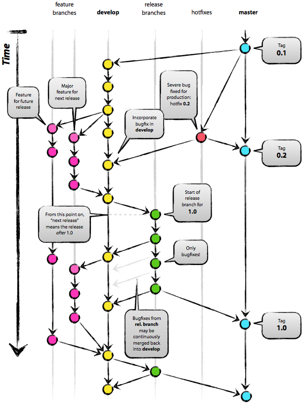
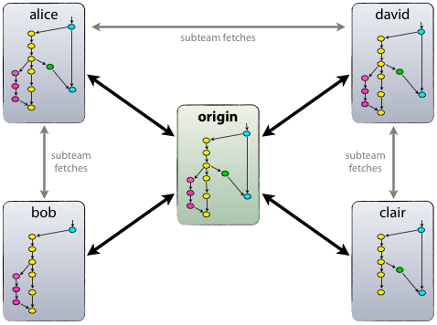
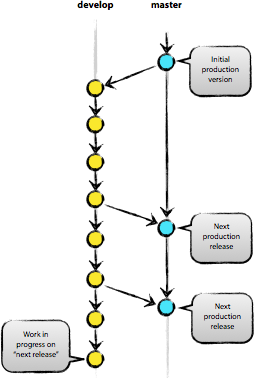
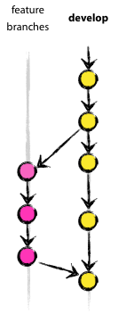
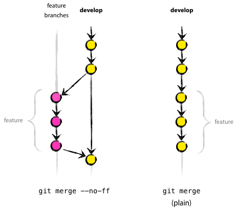
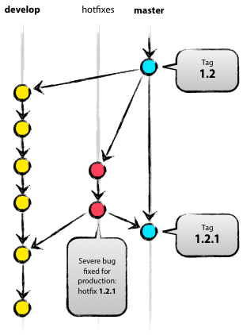

# Лекция 15: Git и командная работа
# Теория Git и командной работы

## Философские основы распределенных систем контроля версий

Система контроля версий Git представляет собой не просто инструмент для хранения истории кода, а воплощение глубоких философских принципов, лежащих в основе современной разработки программного обеспечения. На концептуальном уровне Git реализует модель **распределенного хранения данных**, где каждая копия репозитория содержит полную историю изменений. Эта архитектура отражает более широкий тренд в компьютерных науках — движение от централизованных систем к распределенным, децентрализованным моделям.

Фундаментальное отличие Git от централизованных систем контроля версий (таких как Subversion или CVS) заключается в его **ненадежности на центральный сервер**. В Git нет понятия "основного" репозитория в архитектурном смысле — любой репозиторий может выступать в роли источника истины. Эта децентрализация создает как возможности, так и сложности. С одной стороны, разработчики могут работать полностью автономно, совершая коммиты, создавая ветки и экспериментируя без необходимости постоянного сетевого соединения. С другой стороны, эта свобода требует более сложных механизмов синхронизации и разрешения конфликтов.

## Ментальная модель Git

Чтобы эффективно работать с Git, необходимо построить правильную **ментальную модель** его внутреннего устройства. В основе Git лежит **графовая структура**, где коммиты являются узлами, а связи между ними — ребрами. Каждый коммит содержит ссылку на один или несколько родительских коммитов, образуя направленный ациклический граф. Эта структура принципиально отличается от линейной истории, характерной для централизованных систем.

Ключевым концептом в Git является **хеш-сумма SHA-1**, которая однозначно идентифицирует каждый объект в репозитории. Эта криптографическая хеш-функция обеспечивает целостность данных — любое изменение содержимого объекта приводит к совершенно другой хеш-сумме. Такой подход создает **иммутабельную историю** — после создания коммита его нельзя изменить, можно только создать новый коммит, ссылающийся на старый. Эта неизменность является фундаментальным свойством, обеспечивающим надежность и возможность аудита изменений.

## Три области состояний Git

Git оперирует с тремя основными областями состояний файлов, что создает гибкую, но иногда запутанную модель работы. **Рабочая директория** содержит файлы, с которыми вы непосредственно работаете. **Область подготовленных файлов** (staging area) служит промежуточным буфером, где можно формировать коммит, выбирая, какие изменения будут включены в следующую фиксацию. **Репозиторий** хранит все коммиты и историю проекта.

Эта трехстадийная модель позволяет осуществлять **гранулярный контроль** над тем, что попадает в историю. Разработчик может выбирать отдельные изменения из рабочей директории, добавлять их в staging area и затем фиксировать как атомарный коммит. Такой подход способствует созданию чистой, логически организованной истории, где каждый коммит представляет собой осмысленное, завершенное изменение.

## Ветвление и слияние как философские концепты

Система ветвления в Git является одной из самых мощных и одновременно сложных для понимания возможностей. Ветка в Git — это просто **подвижный указатель** на определенный коммит. Когда вы создаете новую ветку, Git не копирует файлы, а создает новый указатель, который будет двигаться вперед по мере создания новых коммитов. Эта легкость создания веток фундаментально меняет подход к разработке — ветки становятся дешевыми и легковесными, что поощряет их частое использование.

Слияние веток в Git реализует несколько различных алгоритмов, каждый со своей философией. **Рекурсивное слияние** создает новый коммит слияния, который имеет двух родителей и объединяет истории обеих веток. **Fast-forward слияние** происходит, когда целевая ветка не имеет новых коммитов после точки расхождения — в этом случае указатель просто перемещается вперед. **Перебазирование** предлагает альтернативный подход — вместо слияния веток оно переписывает историю, применяя коммиты одной ветки поверх другой.

## Стратегии совместной работы

Git поддерживает различные модели совместной работы, каждая из которых отражает определенную философию организации разработки. **Централизованный workflow** имитирует модель централизованных систем контроля версий, где есть один центральный репозиторий, и все разработчики работают с ним напрямую. Эта модель проста для понимания, но не использует все возможности распределенной природы Git.

**Feature Branch workflow** предполагает, что каждая новая функциональность разрабатывается в отдельной ветке, которая затем сливается в основную ветку через pull request или merge request. Эта модель способствует **изоляции изменений** и позволяет проводить code review до слияния кода. Она создает более чистую историю, но требует дисциплины в управлении ветками.

**GitFlow** представляет собой более формализованную модель с несколькими типами долгоживущих веток: master для production-кода, develop для интеграции, feature-ветки для разработки, release-ветки для подготовки релизов и hotfix-ветки для срочных исправлений. Эта модель хорошо подходит для проектов с предсказуемым циклом релизов, но добавляет значительную сложность.

**Forking workflow** часто используется в open-source проектах. Каждый разработчик создает форк (полную копию) основного репозитория, работает в своем форке, а затем отправляет изменения через pull request. Эта модель обеспечивает максимальную **изоляцию и безопасность** — мейнтейнеры проекта имеют полный контроль над тем, что попадает в основной репозиторий.

## Разрешение конфликтов как социальный процесс

Конфликты слияния в Git — это не просто техническая проблема, а проявление более глубоких социальных и коммуникационных вызовов в разработке программного обеспечения. Когда два разработчика изменяют одни и те же строки кода в разных ветках, Git не может автоматически определить, какая версия является правильной. Это не недостаток системы, а признак того, что **автоматизация достигла своих пределов** и требуется человеческое вмешательство.

Процесс разрешения конфликтов раскрывает важные аспекты командной работы. Во-первых, он выявляет **области пересекающейся ответственности** — если два разработчика часто конфликтуют в одних и тех же файлах, это может указывать на недостаточно четкое разделение обязанностей или на необходимость лучшей коммуникации. Во-вторых, разрешение конфликтов требует **технической и социальной эмпатии** — понимания не только того, какой код технически правилен, но и того, какое решение будет наиболее приемлемым для всех участников.

## Code review как механизм повышения качества

Система pull requests в платформах типа GitHub или GitLab формализует процесс code review, превращая его из необязательной практики в интегральную часть workflow. Code review служит нескольким важным целям: **обнаружение дефектов**, **распространение знаний** о кодовой базе, **поддержание стандартов кодирования** и **формирование коллективной ответственности** за качество кода.

Философия эффективного code review основывается на принципах конструктивной критики и взаимного уважения. Рецензент должен стремиться не просто найти ошибки, но и понять намерения автора, предложить альтернативные подходы и объяснить их преимущества. Автор, в свою очередь, должен быть открыт к обратной связи и рассматривать review как возможность обучения, а не как критику личных способностей.

## Непрерывная интеграция как расширение Git

Современные практики непрерывной интеграции (CI) тесно интегрированы с Git-воркфлоу. Каждый коммит или pull request может автоматически запускать набор тестов, проверок стиля кодирования, сборки и развертывания. Эта автоматизация превращает Git из простого хранилища кода в **активную платформу для обеспечения качества**.

Философски, непрерывная интеграция расширяет концепцию атомарности коммитов. Если каждый коммит должен представлять собой логически завершенное изменение, то CI добавляет требование, чтобы каждый коммит также был **функционально завершенным** — то есть проходил все тесты и проверки. Это создает культуру, где разработчики думают не только о том, как их код работает локально, но и о том, как он будет вести себя в общей системе.

## Эволюция практик работы с Git

Практики работы с Git эволюционируют вместе с развитием самой экосистемы разработки программного обеспечения. Концепция **семантического версионирования** (SemVer) формализует правила именования версий, связывая их с характером изменений в API. **Conventional Commits** стандартизируют формат сообщений коммитов, что позволяет автоматически генерировать changelog и определять тип изменений для SemVer.

**Signed commits** используют GPG-подписи для верификации авторства коммитов, добавляя уровень безопасности и доверия в распределенную систему. **Git Hooks** позволяют автоматически запускать скрипты при определенных событиях в Git, что можно использовать для обеспечения соблюдения стандартов кодирования, запуска тестов или проверки формата сообщений коммитов.

## Психологические аспекты командной работы с Git

Работа с Git в команде затрагивает глубокие психологические аспекты совместной деятельности. **Страх сломать чужой код** может парализовать разработчиков, особенно новичков в проекте. **Нежелание создавать конфликты** может привести к тому, что разработчики будут избегать работы над одними и теми же файлами, даже когда это необходимо.

Эффективные команды развивают **культуру психологической безопасности**, где разработчики чувствуют себя комфортно, внося изменения, создавая ветки и разрешая конфликты. Они понимают, что ошибки и конфликты — это естественная часть процесса разработки, а не признаки некомпетентности. Ключевую роль в создании такой культуры играют лид разработчики и техлиды, которые своим примером демонстрируют правильное отношение к совместной работе.

## Этические аспекты истории Git

История Git, хранящаяся в репозитории, поднимает интересные этические вопросы. С одной стороны, полная неизменяемая история обеспечивает **прозрачность и подотчетность** — всегда можно определить, кто и когда внес определенное изменение. С другой стороны, эта постоянность может создавать проблемы, например, когда в репозиторий случайно попадают конфиденциальные данные (пароли, ключи API).

Git предоставляет инструменты для **переписывания истории** (rebase, filter-branch, BFG Repo-Cleaner), которые позволяют удалять чувствительную информацию из истории. Однако использование этих инструментов создает этическую дилемму — между необходимостью защиты конфиденциальной информации и ценностью неизменяемой, проверяемой истории изменений.

## Заключение

Git — это не просто технический инструмент, а целая экосистема практик, принципов и культурных норм, которые формируют современную разработку программного обеспечения. Понимание Git требует не только знания команд и концепций, но и осознания более глубоких философских и социальных принципов, которые он воплощает.

Эффективная работа с Git в команде — это баланс между индивидуальной свободой и коллективной координацией, между быстрыми итерациями и стабильностью, между экспериментами и надежностью. Мастерство в Git проявляется не только в умении решать сложные технические проблемы, но и в способности использовать этот инструмент для создания продуктивной, collaborative и learning-oriented среды разработки.

## GitFlow
Перевод статьи [Vincent Driessen: A successful Git branching model](http://nvie.com/posts/a-successful-git-branching-model/)



В качестве инструмента управления версиями всего исходного кода она использует Git.


### *Почему Git?*

За полноценным обсуждением всех достоинств и недостатков Git в сравнении с централизованными системами контроля версий обращайтесь к всемирной сети. Там Вы найдёте достаточное количество споров на эту тему. Лично же я, как разработчик, на данный момент предпочитаю Git всем остальным инструментам. Git реально смог изменить отношение разработчиков к процессам слияния и ветвления. В классическом мире CVS/Subversion, из которого я пришёл, ветвление и слияние обычно считаются опасными («опасайтесь конфликтов слияния, они больно кусаются!»), и потому проводятся как можно реже.

Но с Git эти действия становятся исключительно простыми и дешёвыми, и потому на деле они становятся центральными элементами обычного ежедневного рабочего процесса. Просто сравните: в [книгах](http://svnbook.red-bean.com/) по CVS/Subversion ветвление и слияние обычно рассматриваются в последних главах (для продвинутых пользователей), в то время как в [любой](http://book.git-scm.com/) [книге](http://pragprog.com/titles/tsgit/pragmatic-version-control-using-git) [про Git](http://github.com/progit/progit) они бывают упомянуты уже к третьей главе (основы).

Благодаря своей простоте и предсказуемости, ветвление и слияние больше не являются действиями, которых стоит опасаться. Теперь инструменты управления версиями способны помочь в ветвлении и слиянии больше, чем какие-либо другие.

### **Децентрализованный, но централизованный**
Предлагаемая модель ветвления опирается на конфигурацию проекта, содержащую один центральный «истинный» репозиторий. Замечу, что этот репозиторий только считается центральным (так как Git является DVCS, у него нет такой вещи, как главный репозиторий, на техническом уровне). Мы будем называть этот репозиторий термином origin, т.к. это имя и так знакомо всем пользователям Git.



Каждый разработчик забирает и публикует изменения (pull & push) в origin. Но, помимо централизованных отношений push-pull, каждый разработчик также может забирать изменения от остальных коллег внутри своей микро-команды. Например, этот способ может быть удобен в ситуации, когда двое или более разработчиков работают вместе над большой новой фичей, но не могут издать незавершённую работу в origin раньше времени. На картинке выше изображены подгруппы Алисы и Боба, Алисы и Дэвида, Клэр и Дэвида.

Технически это реализуется несложно: Алиса создаёт удалённую ветку Git под названием bob, которая указывает на репозиторий Боба, а Боб делает то же самое с её репозиторием.

### **Главные ветви**



Ядро модели разработки не отличается от большинства существующих моделей. Центральный репозиторий содержит две главные ветки, существующие всё время.
- master
- develop

Ветвь master создаётся при инициализации репозитория, что должно быть знакомо каждому пользователю Git. Параллельно ей также мы создаём ветку для разработки под названием develop.

Мы считаем ветку origin/master главной. То есть, исходный код в ней должен находиться в состоянии *production-ready* в любой произвольный момент времени.

Ветвь origin/develop мы считаем главной ветвью для разработки. Хранящийся в ней код в любой момент времени должен содержать самые последние изданные изменения, необходимые для следующего релиза. Эту ветку также можно назвать «интеграционной». Она служит источником для сборки автоматических ночных билдов.

Когда исходный код в ветви разработки (develop) достигает стабильного состояния и готов к релизу, все изменения должны быть определённым способом влиты в главную ветвь (master) и помечены тегом с номером релиза. Ниже мы рассмотрим этот процесс в деталях.

Следовательно, каждый раз, когда изменения вливаются в главную ветвь (master), мы по *определению* получаем новый релиз. Мы стараемся относиться к этому правилу очень строго, так что, в принципе, мы могли бы использовать хуки Git, чтобы автоматически собирать наши продукты и выкладывать их на рабочие сервера при каждом коммите в главную ветвь (master).

### **Вспомогательные ветви**

Помимо главных ветвей master и develop, наша модель разработки содержит некоторое количество типов вспомогательных ветвей, которые используются для распараллеливания разработки между членами команды, для упрощения внедрения нового функционала (features), для подготовки релизов и для быстрого исправления проблем в производственной версии приложения. В отличие от главных ветвей, эти ветви всегда имеют ограниченный срок жизни. Каждая из них в конечном итоге рано или поздно удаляется.
Мы используем следующие типы ветвей:

- Ветви функциональностей (Feature branches)
- Ветви релизов (Release branches)
- Ветви исправлений (Hotfix branches)

У каждого типа ветвей есть своё специфическое назначение и строгий набор правил, от каких ветвей они могут порождаться, и в какие должны вливаться. Сейчас мы рассмотрим их по очереди.

Конечно же, с технической точки зрения, у этих ветвей нет ничего «специфического». Разбиение ветвей на категории существует только с точки зрения того, как они используются. А во всём остальном это старые добрые ветви Git.

### **Ветви функциональностей (feature branches)**

Могут порождаться от: develop
Должны вливаться в: develop
Соглашение о наименовании: всё, за исключением master, develop, release-* или hotfix-*

Ветви функциональностей (feature branches), также называемые иногда тематическими ветвями (topic branches), используются для разработки новых функций, которые должны появиться в текущем или будущем релизах. При начале работы над функциональностью (фичей) может быть ещё неизвестно, в какой именно релиз она будет добавлена. Смысл существования ветви функциональности (feature branch) состоит в том, что она живёт так долго, сколько продолжается разработка данной функциональности (фичи). Когда работа в ветви завершена, последняя вливается обратно в главную ветвь разработки (что означает, что функциональность будет добавлена в грядущий релиз) или же удаляется (в случае неудачного эксперимента).

Ветви функциональностей (feature branches) обычно существуют в репозиториях разработчиков, но не в главном репозитории (origin).

### **Создание ветви функциональности (feature branch)**

При начале работы над новой функциональностью делается ответвление от ветви разработки (develop).

``` bash
$ git checkout -b myfeature develop

Switched to a new branch "myfeature"
```

**Добавление завершённой функциональности в develop**

Завершённая функциональность (фича) вливается обратно в ветвь разработки (develop) и попадает в следующий релиз.

```bash
$ git checkout develop

Switched to branch 'develop'

$ git merge --no-ff myfeature

Updating ea1b82a..05e9557

(Отчёт об изменениях)

$ git branch -d myfeature

Deleted branch myfeature (was 05e9557).

$ git push origin develop
```
Флаг --no-ff вынуждает Git всегда создавать новый объект коммита при слиянии, даже если слияние может быть осуществлено алгоритмом fast-forward. Это позволяет не терять информацию о том, что ветка существовала, и группирует вместе все внесённые изменения. Сравните:

Во втором случае невозможно увидеть в истории изменений, какие именно объекты коммитов совместно образуют функциональность, — для этого придётся вручную читать все сообщения в коммитах. Отменить функциональность целиком (т.е., группу коммитов) в таком случае невозможно без головной боли, а с флагом --no-ff это делается элементарно.

Конечно, такой подход создаёт некоторое дополнительное количество (пустых) объектов коммитов, но получаемая выгода более чем оправдывает подобную цену.

К сожалению, я ещё не нашёл, как можно настроить Git так, чтобы --no-ff было поведением по-умолчанию при слияниях. Но этот способ должен быть реализован.

### **Ветви релизов (release branches)**
Могут порождаться от: develop
Должны вливаться в: develop и master
Соглашение о наименовании: release-*

Ветви релизов (release branches) используются для подготовки к выпуску новых версий продукта. Они позволяют расставить финальные точки над i перед выпуском новой версии. Кроме того, в них можно добавлять минорные исправления, а также подготавливать метаданные для очередного релиза (номер версии, дата сборки и т.д.). Когда вся эта работа выносится в ветвь релизов, главная ветвь разработки (develop) очищается для добавления последующих фич (которые войдут в следующий большой релиз).

Новую ветку релиза (release branch) надо порождать в тот момент, когда состояние ветви разработки полностью или почти полностью соответствует требованиям, соответствующим новому релизу. По крайней мере, вся необходимая функциональность, предназначенная к этому релизу, уже влита в ветвь разработки (develop). Функциональность, предназначенная к следующим релизам, может быть и не влита. Даже лучше, если ветки для этих функциональностей подождут, пока текущая ветвь релиза не отпочкуется от ветви разработки (develop).

Очередной релиз получает свой номер версии только в тот момент, когда для него создаётся новая ветвь, но ни в коем случае не раньше. Вплоть до этого момента ветвь разработки содержит изменения для «нового релиза», но пока ветка релиза не отделилась, точно неизвестно, будет ли этот релиз иметь версию 0.3, или 1.0, или какую-то другую. Решение принимается при создании новой ветви релиза и зависит от принятых на проекте правил нумерации версий проекта.

### **Создание ветви релиза (release branch)**

Ветвь релиза создаётся из ветви разработки (develop). Пускай, например, текущий изданный релиз имеет версию 1.1.5, а на подходе новый большой релиз, полный изменений. Ветвь разработки (develop) готова к «следующему релизу», и мы решаем, что этот релиз будет иметь версию 1.2 (а не 1.1.6 или 2.0). В таком случае мы создаём новую ветвь и даём ей имя, соответствующее новой версии проекта:

``` bash
$ git checkout -b release-1.2 develop

Switched to a new branch "release-1.2"

$ ./bump-version.sh 1.2

Files modified successfully, version bumped to 1.2.

$ git commit -a -m "Bumped version number to 1.2"

[release-1.2 74d9424] Bumped version number to 1.2

1 files changed, 1 insertions(+), 1 deletions(-)
```

Мы создали новую ветку, переключились в неё, а затем выставили номер версии (bump version number). В нашем примере bump-version.sh — это вымышленный скрипт, который изменяет некоторые файлы в рабочей копии, записывая в них новую версию. (Разумеется, эти изменения можно внести и вручную; я просто обращаю Ваше внимание на то, что некоторые файлы изменяются.) Затем мы делаем коммит с указанием новой версии проекта.

Эта новая ветвь может существовать ещё некоторое время, до тех пор, пока новый релиз окончательно не будет готов к выпуску. В течение этого времени к этой ветви (а не к develop) могут быть добавлены исправления найденных багов. Но добавление крупных новых изменений в эту ветвь строго запрещено. Они всегда должны вливаться в ветвь разработки (develop) и ждать следующего большого релиза.

### **Закрытие ветви релиза**

Когда мы решаем, что ветвь релиза (release branch) окончательно готова для выпуска, нужно проделать несколько действий. В первую очередь ветвь релиза вливается в главную ветвь (напоминаю, каждый коммит в master — это по *определению* новый релиз). Далее, этот коммит в master должен быть помечен тегом, чтобы в дальнейшем можно было легко обратиться к любой существовавшей версии продукта. И наконец, изменения, сделанные в ветви релиза (release branch), должны быть добавлены обратно в разработку (ветвь develop), чтобы будущие релизы также содержали внесённые исправления багов.

Первые два шага в Git:
``` bash
$ git checkout master

Switched to branch 'master'

$ git merge --no-ff release-1.2

Merge made by recursive.

(Отчёт об изменениях)

$ git tag -a 1.2
```

Теперь релиз издан и помечен тегом.

>Замечание: при желании, Вы также можете использовать флаги -s или -u <ключ>, чтобы криптографически подписать тег.

Чтобы сохранить изменения и в последующих релизах, мы должны влить эти изменения обратно в разработку. Делаем это так:
``` bash
$ git checkout develop

Switched to branch 'develop'

$ git merge --no-ff release-1.2

Merge made by recursive.

(Отчёт об изменениях)
```

Этот шаг, в принципе, может привести к конфликту слияния (нередко бывает, что причиной конфликта является изменение номера версии проекта). Если это произошло, исправьте их и издайте коммит.

Теперь мы окончательно разделались с веткой релиза. Можно её удалять, потому что она нам больше не понадобится:

``` bash
$ git branch -d release-1.2

Deleted branch release-1.2 (was ff452fe).
```

### **Ветви исправлений (hotfix branches)**

Могут порождаться от: master
Должны вливаться в: develop и master
Соглашение о наименовании: hotfix-*

Ветви для исправлений (hotfix branches) весьма похожи на ветви релизов (release branches), так как они тоже используются для подготовки новых выпусков продукта, разве лишь незапланированных. Они порождаются необходимостью немедленно исправить нежелательное поведение производственной версии продукта. Когда в производственной версии находится баг, требующий немедленного исправления, из соответствующего данной версии тега главной ветви (master) порождается новая ветвь для работы над исправлением.

Смысл её существования состоит в том, что работа команды над ветвью разработки (develop) может спокойно продолжаться, в то время как кто-то один готовит быстрое исправление производственной версии.

### **Создание ветви исправлений (hotfix branch)**
Ветви исправлений (hotfix branches) создаются из главной (master) ветви. Пускай, например, текущий производственный релиз имеет версию 1.2, и в нём (внезапно!) обнаруживается серьёзный баг. А изменения в ветви разработки (develop) ещё недостаточно стабильны, чтобы их издавать в новый релиз. Но мы можем создать новую ветвь исправлений и начать работать над решением проблемы:

``` bash
$ git checkout -b hotfix-1.2.1 master

Switched to a new branch "hotfix-1.2.1"

$ ./bump-version.sh 1.2.1

Files modified successfully, version bumped to 1.2.1.

$ git commit -a -m "Bumped version number to 1.2.1"

[hotfix-1.2.1 41e61bb] Bumped version number to 1.2.1

1 files changed, 1 insertions(+), 1 deletions(-)
```
Не забывайте обновлять номер версии после создания ветви!

Теперь можно исправлять баг, а изменения издавать хоть одним коммитом, хоть несколькими.

``` bash

$ git commit -m "Fixed severe production problem"

[hotfix-1.2.1 abbe5d6] Fixed severe production problem

5 files changed, 32 insertions(+), 17 deletions(-)
```
### **Закрытие ветви исправлений**

Когда баг исправлен, изменения надо влить обратно в главную ветвь (master), а также в ветвь разработки (develop), чтобы гарантировать, что это исправление окажется и в следующем релизе. Это очень похоже на то, как закрывается ветвь релиза (release branch).

Прежде всего надо обновить главную ветвь (master) и пометить новую версию тегом.
``` bash
$ git checkout master

Switched to branch 'master'

$ git merge --no-ff hotfix-1.2.1

Merge made by recursive.

(Отчёт об изменениях)

$ git tag -a 1.2.1
```
>Замечание: при желании, Вы также можете использовать флаги -s или -u <ключ>, чтобы криптографически подписать тэг.

Следующим шагом переносим исправление в ветвь разработки (develop).

``` bash
$ git checkout develop

Switched to branch 'develop'

$ git merge --no-ff hotfix-1.2.1

Merge made by recursive.

(Отчёт об изменениях)
```

У этого правила есть одно исключение: **если в данный момент существует ветвь релиза (release branch), то ветвь исправления (hotfix branch) должна вливаться в неё, а не в ветвь разработки (develop)**. В этом случае исправления войдут в ветвь разработки вместе со всей ветвью релиза, когда та будет закрыта. (Хотя, если работа в develop требует немедленного исправления бага и не может ждать, пока будет завершено издание текущего релиза, Вы всё же можете влить исправления (bugfix) в ветвь разработки (develop), и это будет вполне безопасно).

И наконец, удаляем временную ветвь:
``` bash
$ git branch -d hotfix-1.2.1

Deleted branch hotfix-1.2.1 (was abbe5d6).
```

### **Заключение**

Хотя в этой модели ветвления совершенно нет ничего принципиально нового, «большая картинка», с которой начинается эта статья, зарекомендовала себя в наших проектах с самой лучшей стороны. Она формирует элегантную мысленную модель, которую легко полностью охватить одним взглядом, и которая позволяет сформировать у команды совместное понимание процессов ветвления и слияния, действующих на проекте.

Высококачественная PDF-версия этой картинки свободна для скачивания [здесь](http://github.com/downloads/nvie/gitflow/Git-branching-model.pdf). Распечатайте её и повесьте у себя на стену, чтобы к ней можно было обратиться в любой момент.


# Техническая теория GitFlow, Pull Requests и разрешения конфликтов

## GitFlow: Системная архитектура

### Теоретическая модель ветвления

GitFlow представляет собой формализованную систему управления ветками, основанную на строгой типизации и жизненном цикле веток. В основе этой модели лежит принцип разделения ответственности между ветками на основе их временных характеристик и назначения.

**Мастер-ветка** (main/master) — это линейная последовательность production-состояний. Каждый коммит в этой ветке должен соответствовать состоянию, которое было фактически развернуто в production. Технически, мастер должен быть защищен от прямых пушей, допуская только fast-forward слияния из релизных веток. Это гарантирует, что история мастер-ветки остается чистой линейной последовательностью, что критически важно для операций бинарного поиска (bisect) при отладке регрессий.

**Разработочная ветка** (develop) — это интеграционная линия, где происходит нелинейное слияние feature-веток. В отличие от мастер-ветки, develop может содержать merge-коммиты, которые фиксируют факт интеграции отдельных фич. Эта ветка представляет собой "передний край" разработки, где новая функциональность проходит первичную интеграцию.

### Типология веток по времени жизни

**Кратковременные ветки** (feature branches) существуют только на время разработки конкретной функциональности. Их жизненный цикл ограничивается периодом от создания от develop до слияния обратно в develop. После слияния эти ветки удаляются, что предотвращает загрязнение пространства имен веток.

**Среднесрочные ветки** (release branches) создаются для изоляции процесса подготовки релиза. Они существуют от момента, когда develop накопил достаточный объем новой функциональности для выпуска, до момента, когда релиз полностью протестирован и готов к развертыванию.

**Экстренные ветки** (hotfix branches) имеют особый статус — они создаются от мастер-ветки для оперативного исправления критических багов в production. Их особенность в том, что они сливаются как в мастер (для немедленного развертывания), так и в develop (для синхронизации).

### Теоретические аспекты именования веток

Система именования в GitFlow следует семантическим правилам:
- `feature/*` — префикс для функциональных веток
- `release/*` — префикс для релизных веток
- `hotfix/*` — префикс для экстренных исправлений

Эта типизация позволяет автоматически классифицировать ветки и применять к ним соответствующие политики (например, требовать code review для feature-веток, но не для hotfix-веток в экстренных ситуациях).

## Pull Requests: Техническая теория

### Pull Request как транзакционная операция

С технической точки зрения, Pull Request — это механизм предложения изменений, который отделяет процесс разработки от процесса интеграции. PR создает изолированный контекст, в котором:
1. Предлагаемые изменения могут быть проанализированы
2. Может быть запущена автоматизированная проверка (CI/CD)
3. Может быть проведен код-ревью
4. Изменения могут быть доработаны на основе обратной связи

### Статусная модель Pull Request

PR проходит через детерминированную последовательность состояний:
1. **Draft** — черновик, изменения еще не готовы для ревью
2. **Open** — готов к ревью, автоматические проверки запущены
3. **Needs work** — после ревью требуются доработки
4. **Approved** — получил необходимые аппрувы
5. **Merged** — успешно слит в целевую ветку
6. **Closed** — закрыт без мержа (например, если фича отменена)

### Система проверок в Pull Request

Современные системы управления Git (GitHub, GitLab, Bitbucket) предоставляют механизмы для автоматического запуска проверок:

**Required status checks** — обязательные проверки, которые должны пройти успешно перед возможностью мержа. Обычно включают:
- Сборку проекта
- Запуск тестов
- Проверку стиля кодирования
- Анализ безопасности

**Branch protection rules** — правила, защищающие целевые ветки:
- Запрет прямого пуша
- Требование review от определенного числа разработчиков
- Требование успешного прохождения CI/CD
- Требование линейной истории (не допускается мерж, если есть конфликты)

### Теория atomic changes в контексте PR

Идеальный PR должен представлять собой атомарное изменение — минимальную единицу функциональности, которая:
- Самостоятельна (может быть понята и проверена изолированно)
- Целостна (решает одну конкретную проблему)
- Обратима (если что-то пойдет не после мержа)

Размер PR — важный технический параметр. Слишком большой PR сложно ревьюить, слишком маленький — создает overhead на интеграцию. Эмпирическое правило: PR должен быть ревьюируемым за 30-60 минут.

## Теория конфликтов слияния

### Классификация конфликтов

Конфликты слияния в Git возникают, когда две ветки изменяют одну и ту же область кода разными способами. С технической точки зрения, Git распознает три уровня конфликтов:

1. **Конфликты содержимого** (content conflicts) — когда разные изменения затрагивают одни и те же строки кода. Git не может автоматически определить, какое изменение должно иметь приоритет.

2. **Конфликты переименования** (rename conflicts) — когда файл переименован в одной ветке и изменен в другой. Git может автоматически разрешать простые случаи, но сложные требуют ручного вмешательства.

3. **Древовидные конфликты** (tree conflicts) — более сложные структурные конфликты, например, когда файл удален в одной ветке и изменен в другой.

### Алгоритмы слияния в Git

Git использует несколько алгоритмов для автоматического слияния:

**Рекурсивная стратегия** — алгоритм по умолчанию для слияния двух веток. Он находит общее предковое состояние (merge base) и создает три версии файла: базовая, версия из текущей ветки и версия из сливаемой ветки. Затем применяется трехстороннее слияние.

**Стратегия разрешения** (ours/theirs) — принудительное принятие версии из текущей (ours) или сливаемой (theirs) ветки. Используется в случаях, когда автоматическое слияние невозможно или нежелательно.

**Octopus слияние** — возможность слить более двух веток одновременно, но только если между ними нет конфликтов.

### Математическая модель конфликтов

Конфликты можно моделировать как пересечения множеств изменений. Пусть:
- A = множество изменений в ветке A
- B = множество изменений в ветке B
- C = A ∩ B (пересечение — общие файлы, измененные в обеих ветках)

Вероятность конфликта пропорциональна |C| (мощности пересечения) и обратно пропорциональна тому, насколько скоординированы были изменения в общих файлах.

### Стратегии предотвращения конфликтов

**Частое слияние** (frequent merging) — регулярное слияние изменений из основной ветки в feature-ветку уменьшает расхождение и, следовательно, вероятность конфликтов.

**Семантическое разделение** (semantic separation) — организация кода таким образом, чтобы разные команды работали над слабосвязанными модулями.

**Коммуникационные протоколы** — соглашения о том, кто и когда может изменять определенные файлы или модули.

### Алгоритмические подходы к разрешению конфликтов

При разрешении конфликтов разработчик должен:
1. **Понять семантику** каждого изменения (почему было сделано то или иное изменение)
2. **Синтезировать решение**, которое сохраняет намерения обоих изменений
3. **Проверить корректность** результирующего кода

Современные IDE предоставляют инструменты для визуального разрешения конфликтов, показывая три версии кода (базовую, локальную и удаленную) и позволяя выбирать, какие фрагменты включать в итоговую версию.

### Теория разрешения конфликтов в распределенных командах

В распределенных командах временные зоны и асинхронная работа создают дополнительные сложности. Конфликты могут оставаться неразрешенными дольше, что увеличивает вероятность дальнейших конфликтов (конфликтующие изменения продолжают развиваться параллельно).

Эффективные практики включают:
- Четкие временные окна для слияния
- Назначение ответственных за разрешение конфликтов в определенных модулях
- Использование feature flags для отложенного слияния конфликтующих изменений

Эта техническая теория предоставляет фундамент для понимания глубоких механизмов GitFlow, Pull Requests и разрешения конфликтов, выходя за рамки простых практических инструкций к пониманию системных принципов.

# Distributed VCS и семантическое версионирование

## Теория распределенных систем контроля версий

### Фундаментальная разница в архитектуре

Распределенные системы контроля версий (DVCS), такие как Git, принципиально отличаются от централизованных систем (CVCS), таких как Subversion (SVN), на архитектурном уровне. В CVCS существует единый центральный репозиторий, который является источником истины. Все клиенты работают с этим центральным сервером, получая от него файлы и отправляя изменения обратно. Эта модель создает единую точку отказа и требует постоянного сетевого соединения для большинства операций.

В DVCS каждый разработчик имеет полную локальную копию репозитория, включающую всю историю изменений. Это не просто кэш или рабочая копия, а полноценный репозиторий. Такой подход превращает систему контроля версий из клиент-серверной архитектуры в полностью распределенную peer-to-peer сеть.

### Теоретические преимущества распределенной модели

**Автономность работы** — разработчики могут выполнять практически все операции локально: создавать коммиты, просматривать историю, создавать ветки, сливать изменения. Сетевое соединение требуется только для синхронизации с другими репозиториями (push/pull). Это особенно важно для разработчиков, работающих в условиях ненадежного интернет-соединения или часто путешествующих.

**Отказоустойчивость** — в DVCS нет единой точки отказа. Если центральный сервер CVCS выходит из строя, работа полностью останавливается. В DVCS каждый локальный репозиторий содержит полную историю, поэтому работа может продолжаться, а при восстановлении сервера изменения могут быть синхронизированы.

**Гибкость workflows** — распределенная природа Git позволяет реализовывать различные модели сотрудничества: от централизованной (аналогичной SVN) до полностью децентрализованной, где любой репозиторий может выступать в роли источника изменений для других.

### Технические различия в хранении данных

SVN использует **дельта-хранилище**, где хранятся только различия между версиями файлов. Это экономит дисковое пространство на сервере, но требует вычислений для восстановления конкретной версии файла. Каждая операция просмотра истории требует обращения к серверу.

Git использует **snapshot-ориентированную модель**. Каждый коммит содержит snapshot всего дерева файлов в этот момент. Измененные файлы хранятся целиком (хотя Git применяет сжатие и дедупликацию). Эта модель делает операции с историей локально быстрыми, поскольку не требуется сетевых запросов или вычислений дельт.

## Почему Git превзошел SVN: технический анализ

### Производительность операций

**Локальные операции** в Git выполняются на порядки быстрее, поскольку не требуют сетевого взаимодействия. Просмотр истории, diff между версиями, переключение между ветками — все это работает мгновенно даже в больших репозиториях.

**Ветвление и слияние** — здесь Git демонстрирует наиболее значительное преимущество. В SVN создание ветки — это операция копирования на сервере, которая может занимать значительное время в больших репозиториях. В Git создание ветки — это просто создание нового указателя на существующий коммит, операция O(1) независимо от размера истории.

### Безопасность и целостность данных

Git использует криптографические хеши SHA-1 для идентификации всех объектов (коммитов, деревьев, файлов). Это обеспечивает:
- **Целостность данных** — любое случайное или злонамеренное изменение содержимого будет обнаружено
- **Идентификацию контента** — каждый объект уникально идентифицируется своим содержимым
- **Дедупликацию** — идентичные объекты хранятся только один раз

SVN полагается на порядковые номера ревизий, которые присваиваются сервером. Эта модель проще для понимания, но менее надежна с точки зрения целостности данных.

### Гибкость рабочих процессов

Git поддерживает множество рабочих процессов:
- **Centralized workflow** — аналогичен SVN, но с локальными коммитами
- **Feature branch workflow** — каждая фича в отдельной ветке
- **Gitflow** — формализованный процесс с релизными и хотфикс-ветками
- **Forking workflow** — стандарт для open-source проектов

SVN исторически использовал в основном централизованный workflow, хотя поздние версии добавили улучшенную поддержку веток.

### Обратная совместимость и миграция

Интересно, что Git может работать как клиент для SVN-сервера через `git svn`, позволяя командам постепенно мигрировать с сохранением инвестиций в существующую инфраструктуру SVN.

## Семантическое версионирование: теория и практика

### Философские основы SemVer

Семантическое версионирование (SemVer) — это не просто соглашение о нумерации версий, а формальный контракт между разработчиками и пользователями программного обеспечения. Основная идея: номер версии должен передавать информацию о характере изменений и их совместимости.

Формат SemVer: `MAJOR.MINOR.PATCH` (например, 2.1.0), где:
- **MAJOR** увеличивается при внесении несовместимых изменений API
- **MINOR** увеличивается при добавлении функциональности обратно-совместимым образом
- **PATCH** увеличивается при обратно-совместимых исправлениях ошибок

### Теоретические принципы SemVer

**Принцип предсказуемости** — пользователи должны иметь возможность предсказывать последствия обновления на основе номера версии. Обновление патча не должно ломать существующую функциональность. Обновление минорной версии может добавлять новые возможности, но не удалять существующие. Мажорное обновление предупреждает о возможных breaking changes.

**Принцип машинной читаемости** — система версионирования должна позволять автоматически определять совместимость версий. Это основа для автоматического разрешения зависимостей в системах сборки (Maven, npm, pip).

**Принцип коммуникации** — номер версии является основным средством коммуникации между разработчиками и пользователями о характере изменений.

### Математическая модель совместимости

С точки зрения теории множеств, можно определить отношение совместимости между версиями:

Пусть V1 = M1.m1.p1 и V2 = M2.m2.p2

V1 и V2 считаются:
- **Полностью совместимыми**, если M1 = M2 и m1 = m2 (любые патч-версии совместимы в пределах одной мажорной и минорной версии)
- **Минорно совместимыми**, если M1 = M2 (минорные версии добавляют функциональность, но не ломают обратную совместимость)
- **Несовместимыми**, если M1 ≠ M2 (мажорные версии могут содержать breaking changes)

### Pre-release и build метаданные

SemVer определяет также формат для pre-release версий и build метаданных:
- `2.0.0-alpha.1` — альфа-релиз
- `2.0.0-beta.2` — бета-релиз
- `2.0.0-rc.1` — release candidate
- `2.0.0+build.123` — сборка с метаданными

Pre-release версии считаются менее стабильными, чем соответствующие release версии, и системы управления зависимостями обычно предпочитают стабильные релизы.

## Интеграция Git и SemVer в современной разработке

### Автоматическое управление версиями

Современные инструменты позволяют автоматически генерировать версии на основе:
- Conventional Commits (анализ сообщений коммитов)
- Тегов в Git
- Конфигурационных файлов

Например, при использовании Conventional Commits с префиксами:
- `fix:` увеличивает PATCH
- `feat:` увеличивает MINOR
- Breaking changes (обозначаемые `!` или footer "BREAKING CHANGE:") увеличивают MAJOR

### Git tags для управления версиями

Git теги идеально подходят для маркировки версий в соответствии с SemVer:
```bash
git tag -a v1.2.3 -m "Release version 1.2.3"
git push origin v1.2.3
```

Системы CI/CD могут автоматически определять версию на основе последнего тега и количества коммитов после него (например, `1.2.3+45` для 45 коммитов после тега v1.2.3).

### Взаимодействие с системами управления зависимостями

SemVer является фундаментом для систем управления зависимостями:
- **npm** использует SemVer для указания диапазонов версий (`^1.2.3`, `~1.2.0`)
- **Maven** имеет похожую, но не идентичную систему
- **Docker** теги образов часто следуют SemVer

### Проблемы и ограничения SemVer

**Субъективность оценки изменений** — различие между breaking change и non-breaking change иногда зависит от того, как используется API. То, что является breaking change для одного пользователя, может быть несущественным для другого.

**Сложность для библиотек с множеством API** — в больших библиотеках изменение одного малозаметного метода технически является breaking change, но на практике может не требовать мажорного обновления.

**Эффект "мажорной версии 0"** — версии 0.x.x освобождаются от требований SemVer, что может приводить к непредсказуемым изменениям даже в минорных и патч-версиях.

## Исторический контекст и эволюция

Переход от CVCS к DVCS и от произвольного версионирования к SemVer отражает более общие тренды в разработке ПО:

**От централизации к распределенности** — параллельно с Git эта тенденция проявляется в переходе от монолитных приложений к микросервисам, от централизованных баз данных к распределенным.

**От неформальных соглашений к формальным контрактам** — SemVer формализует то, что раньше было неявным пониманием между разработчиками, делая взаимодействие более предсказуемым и автоматизируемым.

**От ручных процессов к автоматизации** — интеграция Git и SemVer с CI/CD системами позволяет полностью автоматизировать процесс выпуска версий, уменьшая человеческие ошибки.

Глубокое понимание этих концепций необходимо для проектирования современных процессов разработки, которые сочетают гибкость распределенных систем с предсказуемостью формальных контрактов о версионировании.

# Теория разрешения конфликтов в Merge Request

## Фундаментальная природа конфликтов при слиянии

Конфликты в Merge Request (MR) — это не аномалия, а закономерное следствие параллельной разработки в распределенных системах контроля версий. Когда несколько разработчиков работают над одним кодом одновременно, их изменения неизбежно пересекаются, создавая **семантические коллизии**, которые система не может разрешить автоматически.

Конфликт возникает, когда Git обнаруживает, что два изменения затрагивают одни и те же строки кода разными способами. На техническом уровне это означает, что система не может однозначно определить, какое изменение должно иметь приоритет или как их объединить без потери смысла. Конфликт — это сигнал о том, что **автоматизация достигла своих границ** и требуется человеческое вмешательство для анализа намерений разработчиков и синтеза корректного решения.

## Механизм обнаружения конфликтов в Git

Git использует алгоритм **трехстороннего слияния** для обнаружения конфликтов. Рассмотрим формальную модель:

Пусть есть три версии файла:
- **Base (B)** — общий предок, от которого разошлись ветки
- **Current (C)** — версия в целевой ветке (например, main или develop)
- **Other (O)** — версия в сливаемой ветке (feature branch)

Git применяет операцию слияния: `merge(B, C, O)`. Если для некоторой строки:
- `C == B` и `O != B` — Git принимает изменение из O
- `O == B` и `C != B` — Git принимает изменение из C
- `C == O` — изменения идентичны, конфликта нет
- `C != B` и `O != B` и `C != O` — **КОНФЛИКТ**

Конфликт возникает, когда обе ветки независимо изменили одну и ту же область относительно общего предка. Git маркирует такие области специальными маркерами:
```
<<<<<<< HEAD
код из текущей ветки
=======
код из сливаемой ветки
>>>>>>> branch-name
```

## Классификация конфликтов

### Уровень 1: Текстовые конфликты (Content Conflicts)

Самый распространенный тип, когда изменяются одни и те же строки кода. Git распознает их на уровне diff-алгоритма. Пример: два разработчика меняют условие в одном и том же if-операторе.

### Уровень 2: Структурные конфликты (Tree Conflicts)

Более сложные конфликты, возникающие при операциях с файловой структурой:
- **Удаление-изменение**: файл удален в одной ветке, изменен в другой
- **Переименование-изменение**: файл переименован в одной ветке, изменен в другой
- **Параллельные переименования**: файл переименован по-разному в двух ветках

### Уровень 3: Семантические конфликты (Semantic Conflicts)

Наиболее коварный тип — когда код сливается без текстовых конфликтов, но логика становится некорректной. Пример: изменение сигнатуры метода в одной ветке и вызов этого метода в другой. Git не обнаружит конфликт, но код не скомпилируется.

### Уровень 4: Мета-конфликты (Meta Conflicts)

Конфликты в конфигурационных файлах, зависимостях, настройках сборки. Часто возникают при обновлении версий библиотек или изменении конфигурации CI/CD.

## Процесс разрешения конфликтов

### Шаг 1: Подготовка к разрешению

Перед началом разрешения конфликтов необходимо:
1. **Обновить целевую ветку**: `git checkout main && git pull`
2. **Перейти в feature-ветку**: `git checkout feature-branch`
3. **Начать слияние с опцией `--no-commit`**: `git merge main --no-commit`

Если конфликты обнаружены, Git приостанавливает процесс слияния и предоставляет список конфликтующих файлов.

### Шаг 2: Анализ конфликтов

Каждый конфликт требует трехстороннего анализа:
- **Что было в базовой версии?** (исходное состояние)
- **Что изменилось в целевой ветке?** (изменения, уже принятые в main)
- **Что изменилось в feature-ветке?** (ваши изменения)

Ключевой вопрос: **сохраняют ли оба изменения свою семантическую ценность при объединении?**

### Шаг 3: Стратегии разрешения

#### Стратегия 1: Принятие одной версии

Иногда достаточно выбрать одну из версий:
- **Принять текущую** (HEAD): `git checkout --ours <file>`
- **Принять сливаемую**: `git checkout --theirs <file>`

Эта стратегия подходит, когда изменения в одной ветке полностью заменяют изменения в другой.

#### Стратегия 2: Ручное слияние

Требует редактирования файлов вручную:
1. Открыть конфликтующий файл в редакторе
2. Проанализировать обе версии
3. Создать синтезированную версию, сохраняющую намерения обоих изменений
4. Удалить маркеры конфликта

#### Стратегия 3: Использование инструментов слияния

Современные IDE (IntelliJ IDEA, VS Code) предоставляют визуальные инструменты для трехстороннего слияния, показывающие все три версии одновременно.

### Шаг 4: Верификация решения

После разрешения всех конфликтов необходимо:
1. **Протестировать сборку**: `mvn compile` или эквивалент
2. **Запустить тесты**: убедиться, что изменения не сломали существующую функциональность
3. **Выполнить статический анализ**: проверить code style и потенциальные баги
4. **Завершить слияние**: `git add . && git commit`

## Технические особенности разрешения в Merge Request

### Автоматическое разрешение перебазированием

Многие системы (GitLab, GitHub) предлагают опцию **Rebase and merge**, которая перебазирует feature-ветку на актуальную main перед слиянием. Это создает линейную историю, но может создать больше конфликтов, поскольку изменения применяются последовательно, а не объединяются.

### Стратегия разрешения в веб-интерфейсе

GitLab и GitHub позволяют разрешать простые текстовые конфликты прямо в веб-интерфейсе через редактирование файлов. Это удобно для небольших конфликтов, но не подходит для сложных случаев.

### Использование локальных инструментов

Для сложных конфликтов рекомендуется использовать локальные инструменты:
- **Git mergetool**: запускает внешнюю утилиту для слияния (meld, kdiff3, vimdiff)
- **IDE-интеграция**: специализированные плагины для разрешения конфликтов

## Превентивные стратегии

### Частое слияние (Frequent Integration)

Регулярное слияние изменений из main в feature-ветку (`git merge main`) уменьшает расхождение между ветками, что снижает вероятность и сложность конфликтов. Эта практика — основа Continuous Integration.

### Семантическое разделение кода

Организация кодовой базы по принципу высокой связности внутри модулей и слабой связности между ними естественным образом уменьшает области пересечения изменений.

### Коммуникационные протоколы

Формальные или неформальные соглашения о том, кто и когда может изменять определенные модули, помогают координировать работу и избегать конфликтов.

### Использование Feature Flags

Вместо прямого изменения логики можно использовать feature flags для постепенного включения новой функциональности. Это позволяет отложить слияние конфликтующих изменений до лучшего времени.

## Психологические аспекты разрешения конфликтов

Разрешение конфликтов — это не только техническая, но и социальная задача. Конфликт в коде часто отражает:
- **Разное понимание требований** разработчиками
- **Разные архитектурные предпочтения**
- **Недостаток коммуникации** в команде

Эффективное разрешение требует:
- **Эмпатии**: понимания намерений другого разработчика
- **Коллегиальности**: совместного поиска лучшего решения
- **Объективности**: оценки решений по их техническим достоинствам, а не по авторству

## Метрики и анализ конфликтов

Можно отслеживать метрики конфликтов для улучшения процессов:
- **Частота конфликтов**: количество конфликтов на MR
- **Сложность разрешения**: время, затраченное на разрешение конфликтов
- **Повторяющиеся конфликты**: одни и те же файлы, конфликтующие многократно

Анализ этих метрик может выявить:
- Проблемные модули, требующие рефакторинга
- Недостатки в коммуникации между командами
- Необходимость улучшения архитектурных границ

## Инструментальная поддержка

### CI/CD интеграция

Современные системы CI/CD могут автоматически обнаруживать семантические конфликты:
- **Статический анализ** для обнаружения breaking changes
- **Запуск тестов** после автоматического слияния
- **Проверка совместимости API**

### Автоматическое разрешение простых конфликтов

Некоторые инструменты могут автоматически разрешать тривиальные конфликты:
- **Конфликты в lock-файлах** (package-lock.json, yarn.lock)
- **Конфликты в сгенерированных файлах**
- **Конфликты whitespace**

## Заключение

Разрешение конфликтов в Merge Request — это комплексная дисциплина, сочетающая технические навыки работы с Git, понимание кодовой базы, архитектурное мышление и социальные навыки командной работы. Конфликты неизбежны в любой активно развивающейся кодовой базе, но грамотное управление ими превращает их из проблемы в возможность улучшения кода и процессов.

Мастерство в разрешении конфликтов — один из ключевых навыков senior-разработчика, определяющий способность команды эффективно развивать сложные системы.

# CI/CD: Теория, инструменты и практики

## Фундаментальная теория Continuous Integration и Continuous Delivery

### Философские основы CI/CD

CI/CD — это не просто набор инструментов, а философия разработки программного обеспечения, основанная на принципах автоматизации, обратной связи и непрерывного улучшения. На концептуальном уровне CI/CD представляет собой формализацию цикла Деминга (Plan-Do-Check-Act) применительно к процессу разработки ПО.

**Continuous Integration** (Непрерывная интеграция) — это практика частого слияния изменений всех разработчиков в общую основную ветку. Ключевая идея: обнаружение и исправление проблем на ранней стадии значительно дешевле, чем на поздних этапах разработки. CI превращает интеграцию из редкого, болезненного события в обыденный, автоматизированный процесс.

**Continuous Delivery** (Непрерывная поставка) — расширение CI, обеспечивающее, что любое изменение, прошедшее все этапы проверки, может быть быстро и безопасно развернуто в production. CD создает **автоматизированную линию поставки**, где код движется от разработчика к пользователю с минимальным ручным вмешательством.

### Эволюционная история CI/CD

Исторически CI/CD развивался из нескольких независимых направлений:
1. **Автоматизация сборки** (make, Ant, Maven)
2. **Автоматизированное тестирование** (JUnit, Selenium)
3. **Автоматизация развертывания** (shell-скрипты, конфигурационные менеджеры)
4. **Инфраструктура как код** (Terraform, CloudFormation)

Современные CI/CD системы объединяют эти аспекты в единые рабочие процессы (pipelines), управляемые декларативными конфигурациями.

## Архитектура CI/CD систем

### Компонентная модель

Типичная CI/CD система состоит из:

**Master/Controller** — центральный компонент, который:
- Координирует выполнение задач
- Управляет распределением работы на агенты
- Хранит конфигурацию и историю выполнения
- Предоставляет веб-интерфейс и API

**Agents/Workers/Executors** — распределенные узлы, выполняющие фактическую работу:
- Могут быть специализированными (для определенных типов задач)
- Могут масштабироваться горизонтально
- Часто используют контейнеризацию для изоляции окружений

**Artifact Repository** — хранилище артефактов сборки:
- Двоичные файлы, пакеты, docker-образы
- Обеспечивает версионирование и воспроизводимость
- Интегрируется с системами развертывания

**Secret Management** — безопасное хранение чувствительных данных:
- Ключи API, пароли, сертификаты
- Интеграция с Vault, AWS Secrets Manager и т.д.

### Модель данных CI/CD

CI/CD системы оперируют несколькими типами сущностей:

**Pipeline** — полный рабочий процесс от commit до deployment. Определяет последовательность стадий и условий выполнения.

**Stage** — логическая группа задач (например: сборка, тестирование, развертывание). Стадии выполняются последовательно.

**Job** — атомарная единица работы (например: компиляция Java-кода, запуск unit-тестов). Jobs внутри одной стадии могут выполняться параллельно.

**Artifact** — результат выполнения job (скомпилированный код, отчеты тестирования, docker-образы).

**Environment** — целевое окружение развертывания (development, staging, production).

## GitLab CI/CD: Теория и архитектура

### Философия GitOps

GitLab реализует подход **GitOps**, где конфигурация инфраструктуры и процессы развертывания описываются в том же репозитории, что и код приложения. Это создает **единый источник истины** и обеспечивает полную прослеживаемость изменений.

### Ключевые концепции GitLab CI

**.gitlab-ci.yml** — декларативный файл конфигурации, определяющий весь CI/CD pipeline. Располагается в корне репозитория и версионируется вместе с кодом.

**GitLab Runner** — легковесный агент, выполняющий jobs. Поддерживает несколько executor-ов:
- Shell — выполнение на хосте runner'а
- Docker — изоляция в контейнерах
- Kubernetes — оркестрация в кластере K8s
- SSH — выполнение на удаленных хостах

**Pipeline triggers** — механизмы запуска pipelines:
- Push в репозиторий
- Merge Request
- Webhook-ы из внешних систем
- По расписанию (scheduled pipelines)
- Ручной запуск (manual jobs)

### Модель безопасности GitLab CI

GitLab реализует многоуровневую модель безопасности:

**Переменные окружения** могут быть защищены (masked) и доступны только определенным веткам.

**Безопасные файлы** (например, SSH ключи) могут быть инжектированы в job'ы через механизм GitLab CI/CD File.

**Изоляция окружений** через Docker или Kubernetes обеспечивает безопасное выполнение job'ов.

## Jenkins: Теория и эволюция

### Архитектурная эволюция Jenkins

Jenkins прошел через несколько архитектурных эпох:

**Monolithic Jenkins** (до 2016) — единый сервер со всеми плагинами, сложный в обновлении и масштабировании.

**Jenkins 2.0** (2016) — введение **Pipeline как кода** через Jenkinsfile, declarative и scripted pipelines.

**Cloud Native Jenkins** (современный) — контейнеризация, оркестрация через Kubernetes, Jenkins Operator.

### Jenkins Pipeline: два парадигмы

**Declarative Pipeline** — декларативный синтаксис, проще для начинающих:
```groovy
pipeline {
    agent any
    stages {
        stage('Build') {
            steps {
                sh 'mvn compile'
            }
        }
    }
}
```

**Scripted Pipeline** — императивный подход на Groovy, полная гибкость:
```groovy
node {
    stage('Build') {
        sh 'mvn compile'
    }
}
```

### Jenkins Distributed Architecture

Jenkins использует master-agent архитектуру:

**Jenkins Master**:
- Управляет конфигурацией
- Координирует выполнение build'ов
- Предоставляет веб-интерфейс
- Хранит историю и артефакты

**Jenkins Agent** (ранее Slave):
- Выполняет фактические задачи
- Может быть запущен на различных платформах
- Подключается к master через JNLP или SSH

### Jenkins Plugins Ecosystem

Мощь Jenkins — в его экосистеме плагинов (более 1500). Плагины расширяют функциональность:
- **SCM интеграция** (Git, SVN, Mercurial)
- **Build tools** (Maven, Gradle, Ant)
- **Тестирование** (JUnit, TestNG, Cucumber)
- **Развертывание** (Docker, Kubernetes, AWS)
- **Уведомления** (Email, Slack, Teams)

## Теория Pipeline Design

### Принципы проектирования эффективных pipeline'ов

**Принцип быстрой обратной связи** — наиболее критичные проверки должны выполняться первыми. Сборка и unit-тесты должны завершаться за минуты, а не часы.

**Принцип идемпотентности** — каждый запуск pipeline должен давать одинаковый результат при одинаковых входных данных. Достигается через:
- Версионирование зависимостей
- Использование контейнеров с фиксированными образами
- Очистка рабочего пространства между запусками

**Принцип изоляции стадий** — каждая стадия должна быть максимально независима. Это позволяет:
- Параллельное выполнение независимых стадий
- Легкое переиспользование стадий в разных pipeline'ах
- Простую отладку и мониторинг

### Моделирование pipeline'ов как графов

Pipeline можно представить как **направленный ациклический граф (DAG)**, где:
- Вершины = jobs/stages
- Ребра = зависимости выполнения
- Веса = время выполнения

Оптимизация pipeline — это задача нахождения критического пути и его сокращения.

### Теория parallel execution

Параллельное выполнение jobs основано на анализе зависимостей:
- **Data parallelism** — обработка независимых данных разными workers
- **Task parallelism** — выполнение независимых задач одновременно
- **Pipeline parallelism** — overlap разных стадий pipeline'а

Ограничения: ресурсы (CPU, память, лицензии), зависимости данных, последовательные этапы (например, сборка перед тестированием).

## Теория deployment strategies

### Blue-Green Deployment

Две идентичные production-среды (Blue и Green). Трафик переключается между ними. Теория:
- **Нулевое время простоя** при развертывании
- **Мгновенный откат** при проблемах
- **Ресурсные затраты** (нужны две полные среды)

### Canary Releases

Постепенное развертывание новой версии небольшому проценту пользователей. Теория:
- **Риск-ориентированный подход** — минимизация impact при проблемах
- **Постепенный сбор метрик** производительности и ошибок
- **Сложность управления трафиком** (требует продвинутых load balancer'ов)

### Feature Flags

Управление функциональностью через конфигурацию, а не через развертывание кода. Теория:
- **Отделение развертывания от релиза**
- **A/B тестирование** без множественных развертываний
- **Усложнение кода** условиями и ветвлениями

## Теория мониторинга CI/CD

### Four Golden Signals для CI/CD

Адаптация концепции из SRE:
1. **Latency** — время выполнения pipeline'ов
2. **Traffic** — количество запусков pipeline'ов
3. **Errors** — процент неудачных pipeline'ов
4. **Saturation** — загрузка агентов/раннеров

### Модели анализа эффективности

**Lead Time for Changes** — время от commit до production. Оптимизация: уменьшение batch size, параллелизация.

**Deployment Frequency** — как часто развертываются изменения. Показатель зрелости процесса.

**Mean Time to Recovery** — время восстановления после инцидента. Связано с эффективностью rollback механизмов.

**Change Failure Rate** — процент развертываний, вызывающих инциденты. Индикатор качества тестирования.

## Теория безопасности в CI/CD

### Security Pipeline

Интеграция security checks в CI/CD:
- **SAST** (Static Application Security Testing) — анализ исходного кода
- **DAST** (Dynamic Application Security Testing) — тестирование running приложения
- **SCA** (Software Composition Analysis) — анализ зависимостей на уязвимости
- **Secret Detection** — поиск секретов в коде

### Principle of Least Privilege в CI/CD

Каждому job'у предоставляются минимально необходимые привилегии:
- Отдельные service accounts для разных окружений
- Временные credentials через Vault или cloud providers
- Изоляция через namespaces в Kubernetes

## Теория масштабирования CI/CD систем

### Горизонтальное vs вертикальное масштабирование

**Вертикальное** — увеличение мощности одного master/agent. Ограничено физическими пределами одной машины.

**Горизонтальное** — добавление большего количества агентов. Требует решения проблем:
- Распределения нагрузки
- Консистентности конфигурации
- Управления зависимостями

### Elastic CI/CD

Динамическое масштабирование инфраструктуры под нагрузку:
- **Auto-scaling groups** в облачных провайдерах
- **Kubernetes horizontal pod autoscaling**
- **Spot instances** для экономии на прерываемых ресурсах

## Теория экономики CI/CD

### Cost-Benefit Analysis автоматизации

**Капитальные затраты (CapEx)**:
- Лицензии инструментов
- Инфраструктура для CI/CD
- Время на настройку и обучение

**Операционные затраты (OpEx)**:
- Вычислительные ресурсы
- Хранение артефактов
- Поддержка и обновление

**Выгоды**:
- Сокращение manual labor
- Уменьшение human error
- Ускорение time-to-market
- Улучшение качества и стабильности

### ROI CI/CD систем

Рассчитывается как:
```
ROI = (Сокращение затрат + Увеличение доходов) / Затраты на CI/CD
```

Где:
- Сокращение затрат = меньше manual deployment, меньше downtime
- Увеличение доходов = более быстрая доставка фич, лучшее качество

## Будущие тренды в теории CI/CD

### AI/ML в CI/CD

Применение машинного обучения для:
- **Predictive analysis** — предсказание проблем до их возникновения
- **Intelligent test selection** — запуск только релевантных тестов
- **Anomaly detection** в метриках развертывания

### GitOps как evolution CI/CD

GitOps расширяет CI/CD:
- **Декларативное управление инфраструктурой**
- **Continuous Reconciliation** — автоматическое приведение системы к желаемому состоянию
- **Audit trail** через Git history

### Progressive Delivery

Эволюция Canary releases:
- **Automatic rollback** на основе метрик
- **Multi-dimensional canary** (география, устройства, пользовательские сегменты)
- **Machine learning-driven** трафик shifting

Эта теоретическая основа обеспечивает глубокое понимание не только как работают CI/CD системы, но и почему они устроены именно так, и каковы фундаментальные принципы, лежащие в их основе.